# 基于springboot的相亲网站

---
### 👉作者QQ ：1556708905 微信：zheng0123Long (支持定制修改、部署调试、定制毕设)

### 👉接网站建设、小程序、H5、APP、各种系统等

---

#### 介绍

随着社会的发展和人们生活节奏的加快，相亲逐渐成为一种常见的社交和寻找伴侣的方式。为了满足人们对于高效、便捷相亲服务的需求，我们开发了这个基于 Spring Boot 的相亲网站。该网站旨在为用户提供一个安全、可靠、功能丰富的相亲平台，帮助用户找到理想的伴侣。

#### 技术栈

后端技术栈：Springboot+Mysql+Maven

前端技术栈：Vue+Html+Css+Javascript+ElementUI

开发工具：Idea+Vscode+Navicate

#### 系统功能介绍

（一）管理员角色  
个人中心：管理员可在此查看和修改个人信息，接收系统通知和重要消息。  
婚礼公司管理  
婚礼公司管理：对入驻网站的婚礼公司进行审核、信息维护和管理，确保其合法合规和服务质量。  
婚礼公司收藏管理：查看用户对婚礼公司的收藏情况，分析热门婚礼公司。  
婚礼公司预约管理：处理用户对婚礼公司的预约请求，协调相关事宜。  
结婚案例管理   
结婚案例管理：审核和发布用户提交或网站收集的结婚案例，确保内容真实、积极。  
结婚案例收藏管理：了解用户对结婚案例的收藏偏好，为推荐和优化内容提供依据。  
用户管理：对网站用户的信息进行管理，包括审核注册信息、处理违规行为等。  
相亲管理  
相亲管理：监督相亲活动的组织和开展，确保活动的顺利进行。  
相亲留言管理：审核和管理用户在相亲活动或个人页面中的留言，维护良好的交流氛围。  
相亲收藏管理：掌握用户对相亲对象的收藏情况，分析用户的喜好和需求。  
轮播图信息管理：负责网站首页轮播图的内容更新和展示顺序调整，以突出重要活动、优质用户等信息。  

（二）用户角色  
婚礼公司：浏览和筛选不同的婚礼公司，了解其服务内容、价格和用户评价，可进行收藏和预约。  
结婚案例：查看各种结婚案例，获取灵感和参考，能够收藏喜欢的案例。  
相亲：参与相亲活动，查看其他用户的资料，进行相亲留言和收藏感兴趣的对象。  
个人中心：完善个人资料，设置相亲偏好，查看自己的收藏、预约、留言等记录。  
后台管理  
婚礼公司管理  
婚礼公司管理：同上述用户角色中的婚礼公司功能，可对已收藏的婚礼公司进行比较和筛选。  
婚礼公司收藏管理：方便快捷地找到收藏的婚礼公司，随时查看其最新动态。  
婚礼公司预约管理：管理自己对婚礼公司的预约，查看预约状态和详情。  
结婚案例管理  
结婚案例管理：可对不同的结婚案例进行分类和标记，方便后续查看。  
结婚案例收藏管理：集中管理收藏的结婚案例，与他人分享或再次回顾。  
相亲管理  
相亲管理：查看自己参与的相亲活动记录和相关信息。  
相亲留言管理：回复他人给自己的留言，管理留言的显示和隐藏。  
相亲收藏管理：对收藏的相亲对象进行进一步的了解和沟通。  
轮播图信息：查看网站首页的轮播图，获取重要活动和推荐信息。  

#### 系统作用

提供便捷服务  
为用户提供了一个集中、便捷的相亲资源平台，节省了用户寻找和筛选的时间和精力。  
促进交流互动  
通过留言、收藏等功能，促进用户之间的交流和互动，增加相亲成功的机会。  
丰富参考资料  
婚礼公司和结婚案例的展示为用户提供了丰富的参考，有助于规划未来的婚姻生活。  
保障平台秩序  
管理员的有效管理能够保障网站的正常运行，维护良好的网络环境和用户体验。  
提升匹配效率  
基于用户的偏好和行为数据，系统能够为用户提供更精准的相亲推荐，提高匹配成功率。  

#### 系统功能截图

代码结构

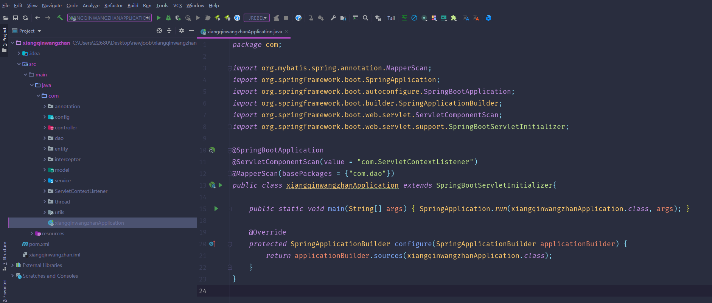

数据库表

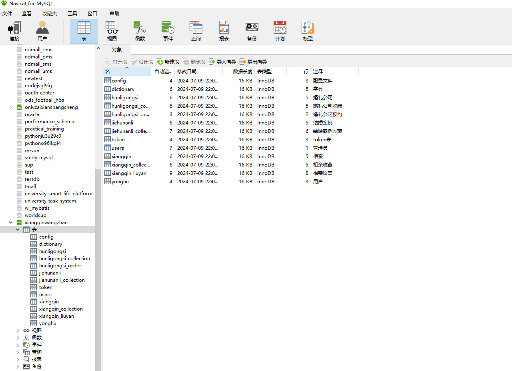

登录

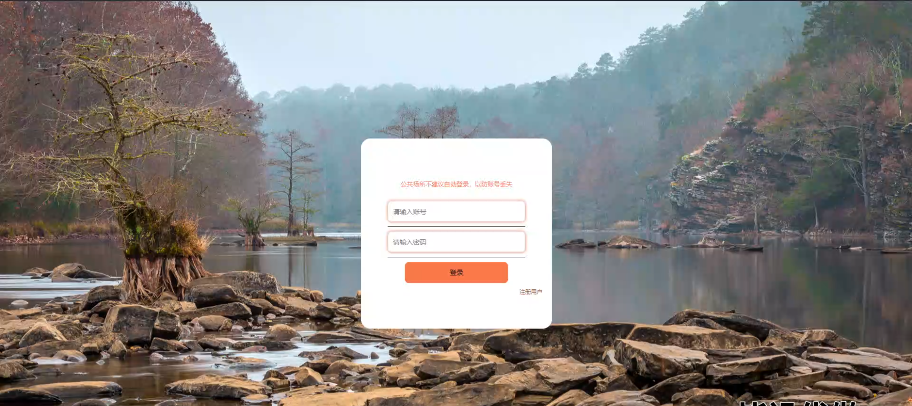

前台页面首页

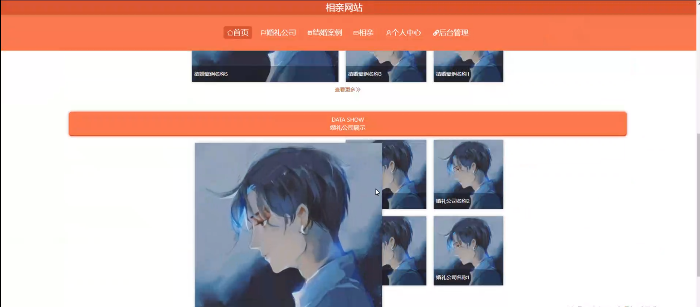

婚礼公司

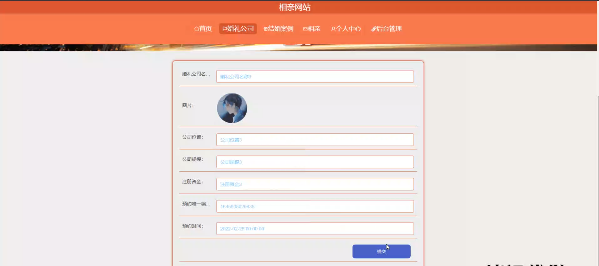

结婚案例

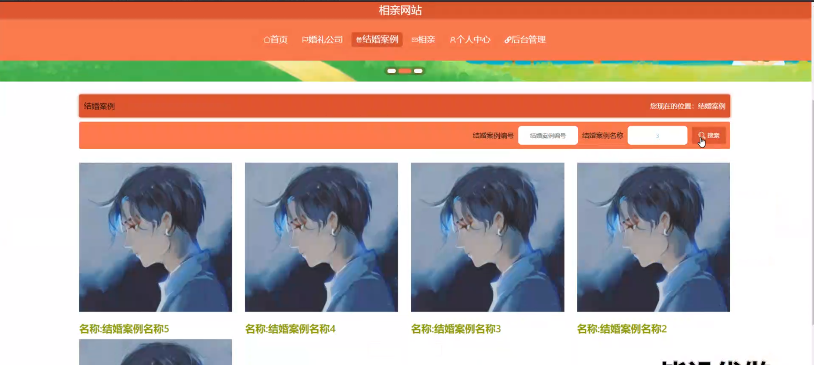

相亲

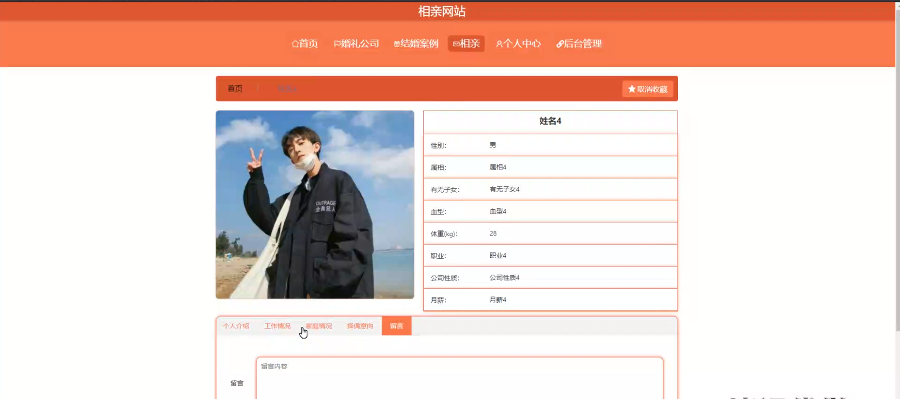

个人中心

用户端后台管理

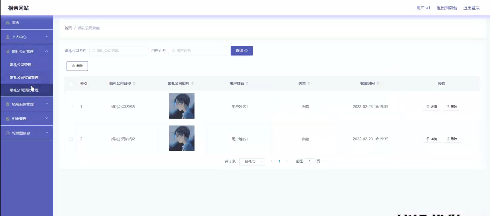

相亲管理

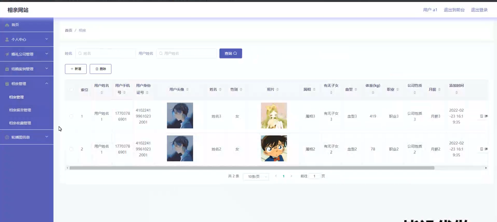

结婚案例管理

管理员端结婚案例管理

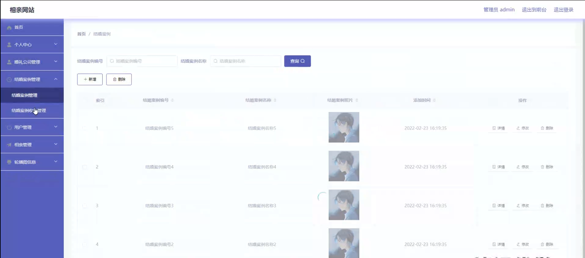

轮播图信息管理

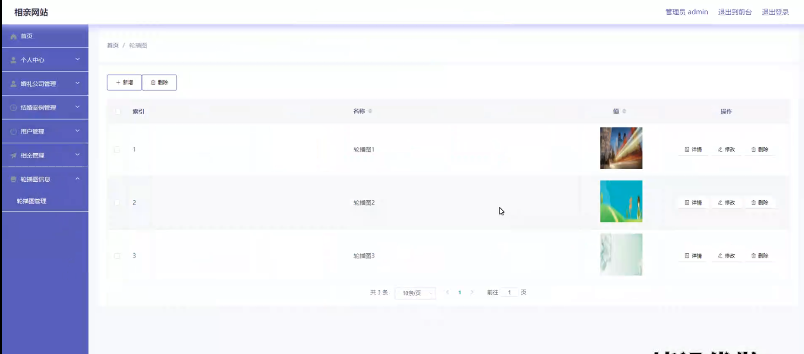

用户管理

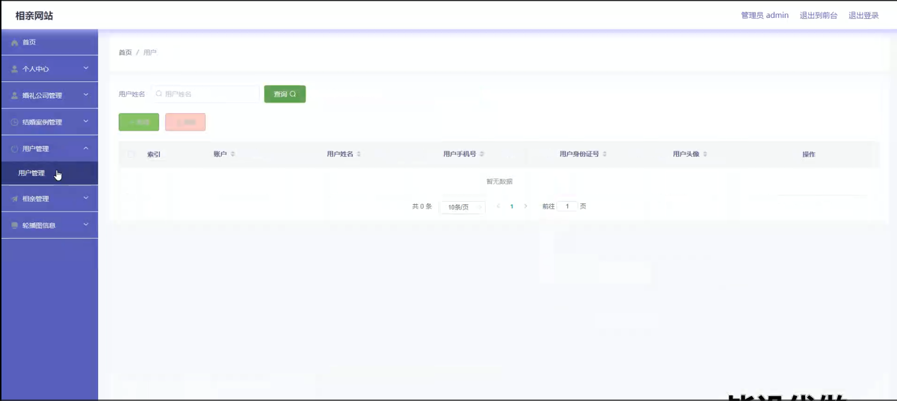

#### 总结

基于 Spring Boot 的相亲网站通过管理员和用户的不同功能模块，构建了一个全面、高效、互动性强的相亲服务体系。管理员能够有效地维护网站的运营和秩序，用户能够便捷地获取所需信息和服务，从而提高相亲的效率和质量，为用户的幸福生活助力。

#### 使用说明

创建数据库，执行数据库脚本 修改jdbc数据库连接参数 下载安装maven依赖jar 启动idea中的springboot项目

前台登录页面
http://localhost:8080/xiangqinwangzhan/front/index.html

后台登录页面
http://localhost:8080/xiangqinwangzhan/admin/dist/index.html

管理员			账户:admin 	密码：admin
用户				账户:a1 		密码：123456
用户				账户:a2 		密码：123456
用户				账户:a3 		密码：123456